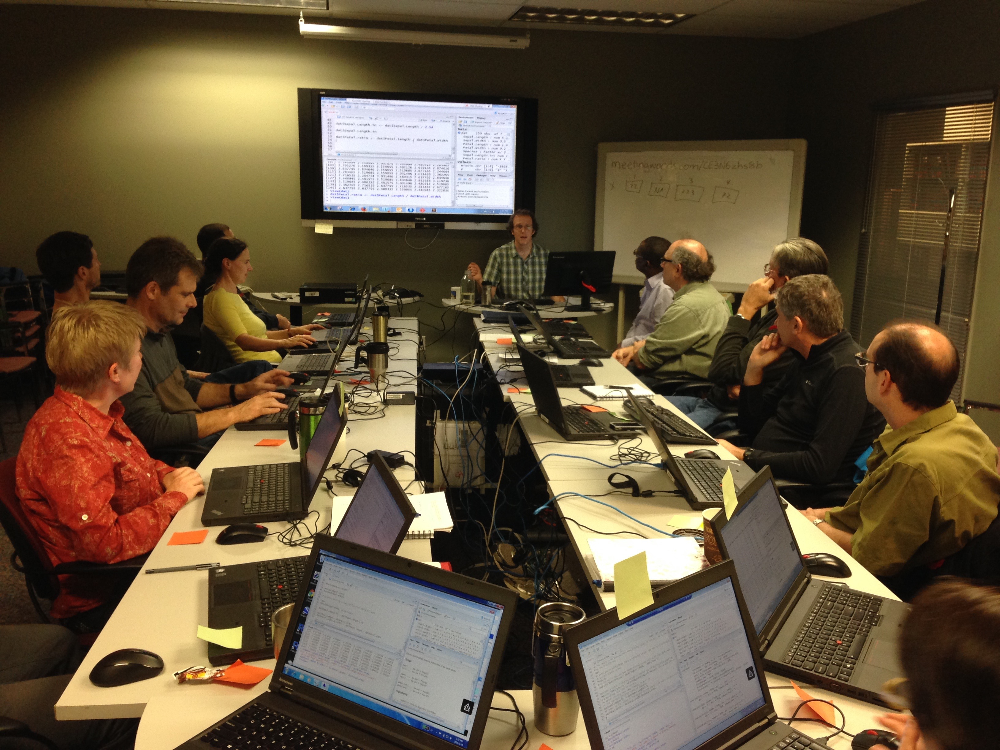
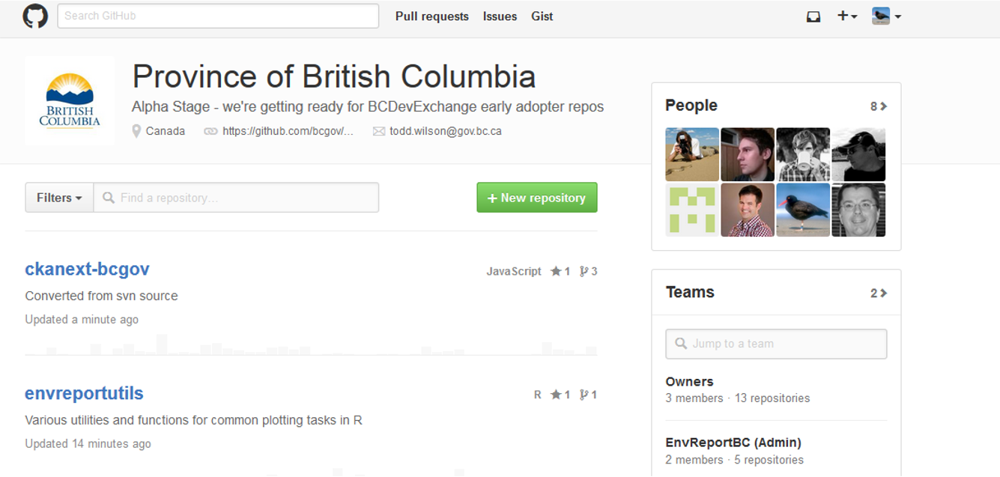
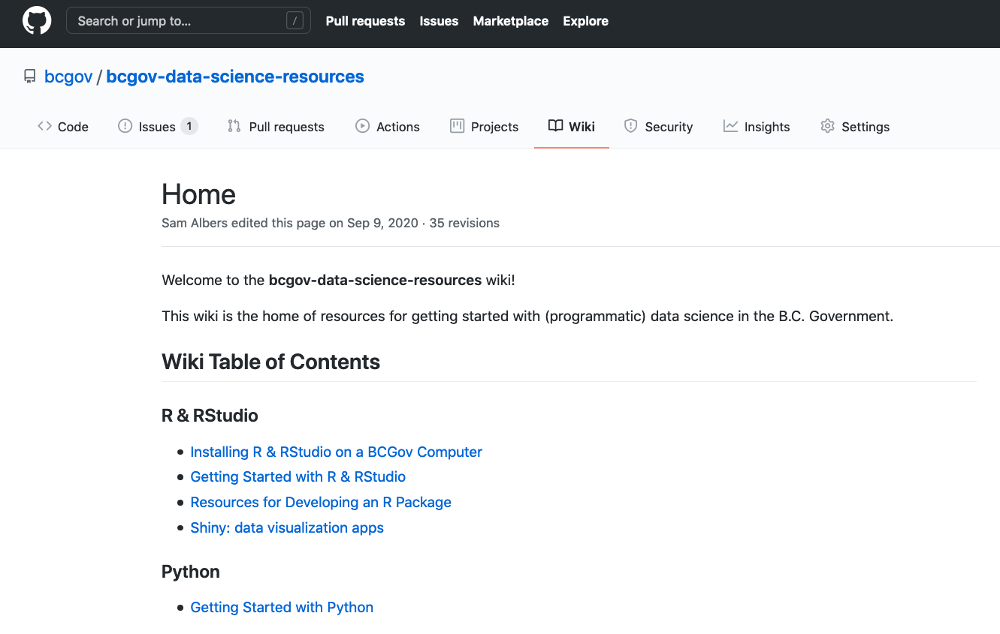
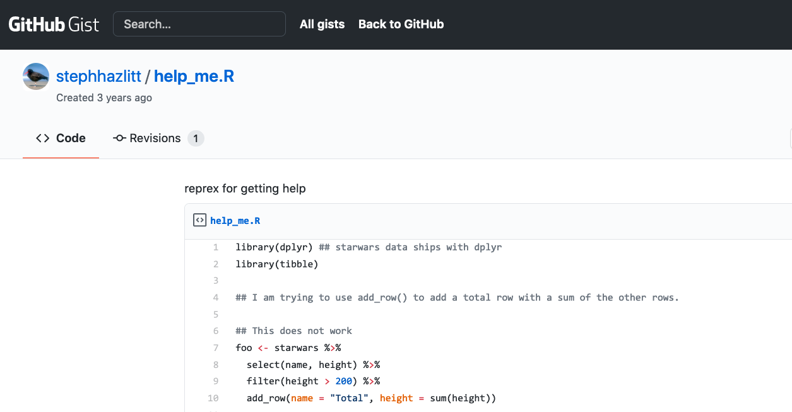
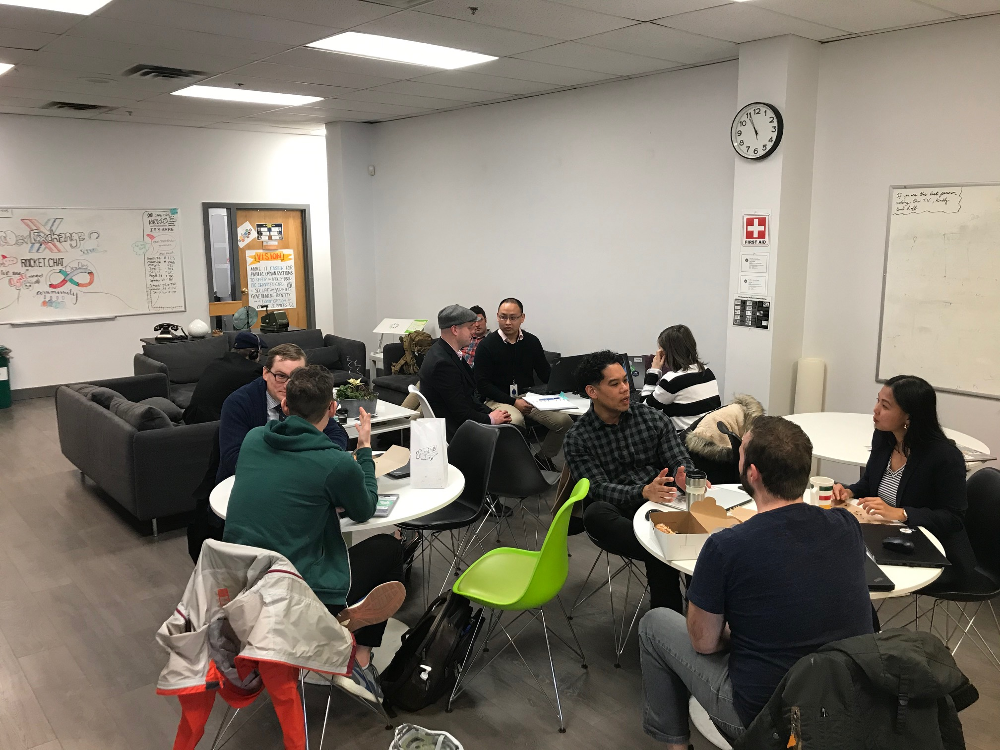
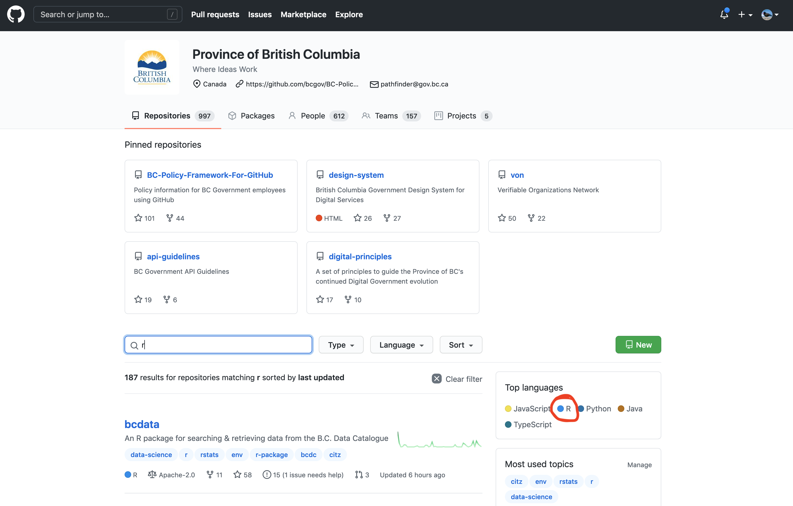
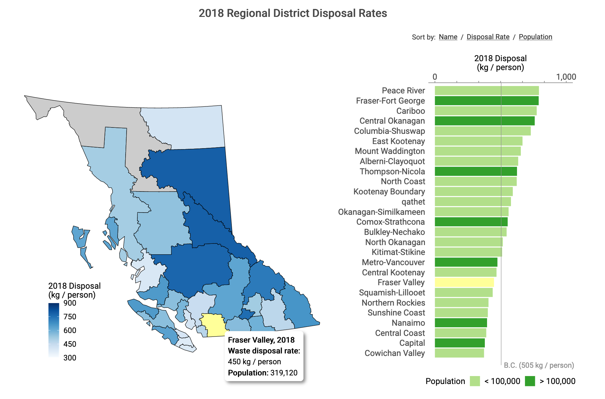
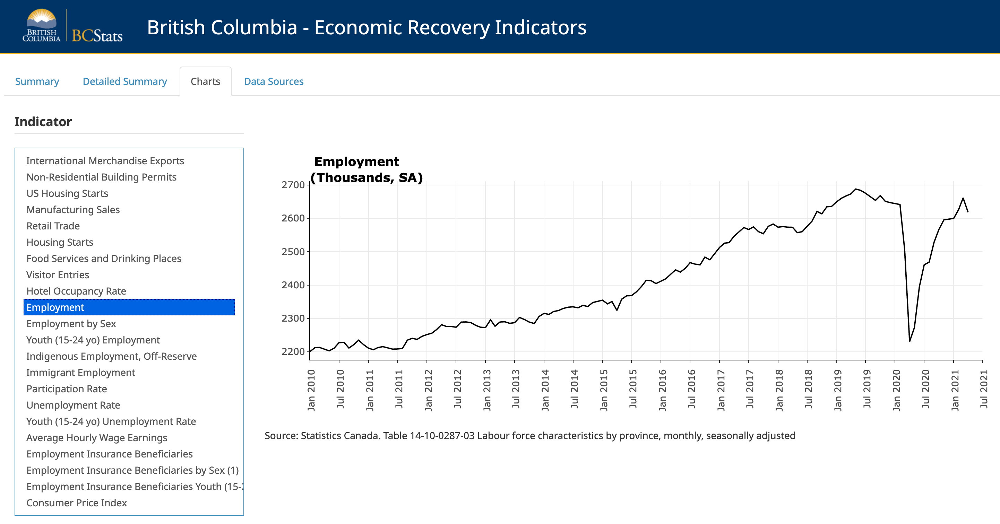

```{r, include=FALSE, eval=FALSE}
# Abstract
# 
# The BC Public Service has seen a significant shift towards the use of R and other data science tools for data analysis and communication. In the natural world, these regime shifts---large, persistent changes to a system---usually require some perturbation (either internal or external) or disturbance event to initiate the shift. This talk will share insider observations of some of the events, processes, and even a disturbance, that have helped kickstart and support the use and growth of R and develop a data science community. Together these changes, with some ongoing organizational support, have enabled some individual contributors, data science teams and leadership in the BC Public Service to shift towards more programmatic, open and reproducible data science workflows.
```

```{r setup, include=FALSE}
options(htmltools.dir.version = FALSE)
options(width = 90)
options(max_print = 5)
options(silence_named_get_record_warning = TRUE)
old.hooks <- fansi::set_knit_hooks(knitr::knit_hooks)
options(crayon.enabled = TRUE)
knitr::opts_chunk$set(
  collapse = TRUE,
  #echo = FALSE,
  comment = "",
  warning = FALSE,
  message = FALSE,
  fig.path = "graphics/prod/figs",
  fig.width = 10,
  fig.height = 5
)
options(scipen = 10)

library(dplyr)
library(bcmaps)
library(sf)
library(ggplot2)
library(viridis)
library(tidycensus)
library(readr)
library(stringr)
library(cowplot)
library(tweetrmd)
library(gh)
library(purrr)
library(lubridate)
options(tigris_use_cache = TRUE)
```

```{r, echo=FALSE, cache=TRUE, message=FALSE}
cascadia <- get_acs(
  state = c("WA", "OR"),
  geography = "state",
  variables = "B19013_001",
  geometry = TRUE
) %>%
  select(NAME) %>%
  transform_bc_albers() %>%
  bind_rows(bc_neighbours() %>%
              filter(name == "British Columbia") %>%
              select(NAME = name))

r_use_df <- read_csv("data/r-growth-bcps.csv")

bcgov_logo <- "images/BCID_V_cmyk_pos.jpg"
```

class: clear, no-number

## BC Public Service 🇨🇦 

<hr>

.wide-right[
```{r, echo=FALSE, fig.height=13, fig.align='centre', fig.alt="Map showing the boundaries of the province of British Columbia and Washington and Oregon states"}
ggplot(cascadia) +
  geom_sf(aes(fill = NAME), alpha = .5) +
  geom_sf_text(aes(label = NAME), size = 10) +
  geom_sf(
    data = bc_cities() %>% filter(NAME == "Victoria"),
    size = 10,
    colour = "#3F3770FF"
  ) +
  theme_minimal() +
  coord_sf(datum = NA) +
  labs(x = NULL, y = NULL, fill = NULL) +
  theme(legend.position = "none") +
  scale_fill_viridis(discrete = TRUE,
                     option = "viridis")
```
]

.pull-left[

]

---

class: clear, no-number

## @stephhazlitt

<hr>

.wide-left[
```{r, eval=FALSE}
## Steph's Path

"Bird Biologist" %>% 
"Research Scientist" %>% 
"Conservation Specialist" %>% 
"Environmental Reporting" %>% # R
"Senior Data Scientist"
```
]


---

class: clear, no-number

## Growth in the Use of R in the BC Public Service

<hr>

```{r, echo=FALSE, fig.width=16, fig.height = 7, fig.align='center', fig.alt="Plot of significant milestones, shown with text labelling, in the use of R in the BC Public Service 2012 to 2021"}
r_changes <- ggdraw() +
  draw_image(bcgov_logo,
             y = .3,
             x = -.43,
             scale = .35) +
  draw_plot(
    r_use_df %>%
      ggplot(aes(year, fake_y)) +
      geom_point(size = 0) +
      geom_label(aes(label = str_wrap(use_r, width = 10)),
                size = 9, fontface = "bold", colour = "#440154FF") +
      scale_x_continuous(
        limits = c(2011, 2021.5),
        breaks = seq(2012, 2021, 1)
      ) +
      scale_y_continuous(limits = c(-1, 12)) +
      theme_minimal() +
      labs(x = NULL, y = NULL) +
      theme(
        axis.text.y = element_blank(),
        axis.text.x = element_text(size = 18, face = "bold"),
        legend.position = "none",
        panel.grid.minor = element_blank()
      )
  )
r_changes
```

---

class: clear, no-number

## Regime Shifts in Natural Ecosystems

<hr>

.Large.pull-left[
- Large changes in the structure & function of a system  
  
- Shifts: a smooth internal change in a process  _or_ an external disturbance triggering a change

.footnote[https://en.wikipedia.org/wiki/Regime_shift]

 ]

.pull-right[
.teeny[Map: Lauren Tierney CC BY-SA 4.0]
]

???

- A smooth change in an internal process (feedback)
- _OR_ a disturbance triggering a different system behaviour (external shock)

---

class: clear, no-number, center

## Internal Change: Building a Learning Community

<hr>



---

class: clear, no-number

## Learning from Other Communities

<hr>

.right-column[.center[

```{r, echo=FALSE, fig.alt=""}
tweet_screenshot(tweet_url("stephhazlitt", "449031152926330880"), maxwidth = 350)
```

]]

.left-column[

]

---

class: clear, no-number

## Disturbance: bcgov GitHub 🎉

<hr>

.center[

]

.footnote[https<nolink>://github.com/bcgov (2013)]

---

class: clear, no-number, center

## Open Learning Content

<hr>



.pull-right[
.footnote[https://github.com/bcgov/bcgov-data-science-resources/wiki]]

---

class: clear, no-number

## Helping Became Easier

<hr>

.pull-left[

]

.pull-right[

]

.footnote[https://gist.github.com/stephhazlitt/c6ccc36b5ea0ff190cf479659d164b8e]

---

class: clear, no-number, center

## Open Code 🚀

<hr>

✂️ & 📋 -> Collaborations -> Contributions -> Code Reviews



.pull-right[.footnote[https://github.com/bcgov]]

---

class: clear, no-number, center

## ## Growth in the Use of R & in the BC Public Service

<hr>

```{r, cache=TRUE}
#get number of bcgov repos
bcgov <- gh("/orgs/bcgov")
n_repos <- bcgov[["public_repos"]]

#get all repo names and date created
repo_names <- map_df(seq_len(ceiling(n_repos/30)), ~{
  repos <- gh("GET /orgs/{org}/repos", org = "bcgov", page = .x)
  data.frame(
    name = vapply(repos, "[[", "", "name"),
    date_created = vapply(repos, "[[", "", "created_at")
  )
})

#get repo language
language <- map_df(repo_names$name, ~{
  data.frame(
    top_language = names(gh("/repos/bcgov/{repo}/languages", repo = .x))[1],
    name = .x
  )
})

#join together and find the cumulative number of repos
repos_over_time <- repo_names %>% 
  left_join(language, by = "name") %>% 
  mutate(date_created = ymd_hms(date_created)) %>% 
  mutate(date = as.Date(date_created)) %>% 
  group_by(top_language, date) %>% 
  summarise(n = n()) %>% 
  mutate(cumu = cumsum(n))

#create a df for labelling
label_df <- repos_over_time %>% 
  group_by(top_language) %>% 
  filter(cumu == max(cumu)) %>% 
  ungroup() %>% 
  slice_max(order_by = cumu, n = 10)

#plot
repos_over_time %>% 
  ggplot(aes(x = date, y = cumu, colour = top_language)) +
  geom_line() +
  geom_text(data = label_df, aes(y = cumu, label = top_language), x = max(label_df$date) + 40) +
  labs(y = "Cumulative Number of bcgov Repositories", title = "Cumulative Number of Repositories by Top Language Used within the Repository") +
  guides(colour = FALSE) +
  theme_minimal()
```


---

class: clear, no-number, center

## Current State: bcgov R Open Source

<hr>





???

- CRAN
- Emily Riederer talk
- individuals, teams & CRAN

---

class: clear, no-number, center

## Current State: Data Science Community of Practice

<hr>


---

class: clear, no-number

## Current State: R Learning in the BCPS

<hr>

.pull-left[

- getting started  
- geospatial  
- big data  
- reproducibility  
- bridging workflows  
 ]
 
 .pull-right[
 
 
 .footnote[bcgov Data Science CoP webinar poster, May 19th 2021
 ]]

---

class: clear, no-number, center

## Observation: People

<hr>

.pull-left[

]

.pull-right[

  
  


]

---

class: clear, no-number, center

## Observation: Trust

<hr>

```{r, echo=FALSE, fig.alt="Image of a tweet quoting a speaker saying go at the speed of trust"}
tweet_screenshot(tweet_url("stephhazlitt", "1179819866955534336"), maxwidth = 350)
```

---

class: clear, no-number

## Future State?

<hr>

.left-title[
```{r}
R_growth <- "regime shifts?"
```

- non-linear  
- many stable states  
- expected to increase 

```{r, include=FALSE, fig.width=3, fig.height=2, fig.align='center'}
df <- data.frame(y = c(1,2,1,2,3,3,3,3,1,1,5,5,5,8,8,8,7,9,9,8,9,10),
                 x = c(1:22))
df %>% 
  ggplot() +
  geom_line(aes(x,y), colour = "#440154FF", size = 3) +
  labs(x = NULL, y = NULL) +
  theme_minimal() +
  theme(axis.text = element_blank()) +
  annotate("segment", x = 22.2, xend = 22, y = 8.4, yend = 10,
           colour = "#440154FF", size = 3, lineend = "round") +
  annotate("segment", x = 20, xend = 22, y = 9.6, yend = 10,
           colour = "#440154FF", size = 3, lineend = "round") 
```
]

.right-title[


]

---

class: clear, no-number, center

## Cascadia R Conf 2021: Infectious Ideas

<hr>

"Be Kind, Be Calm, Be Safe"  – Dr. Bonnie Henry 🇨🇦 


@stephhazlitt on Twitter & GitHub  
https://github.com/stephhazlitt/regime-shifts

???

Sessions:
- Sharing R Love
- Reporting & Sharing of R
- Using R
- Shiny and R
- Education & Community


