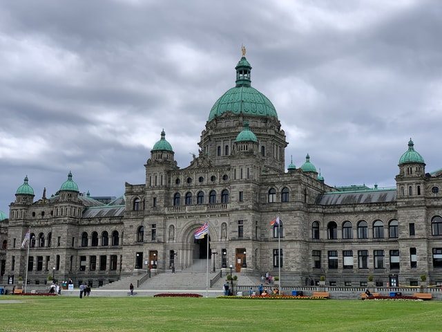
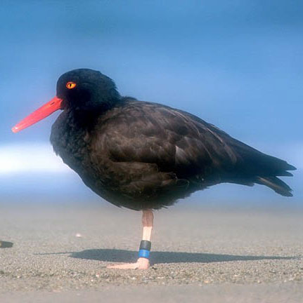
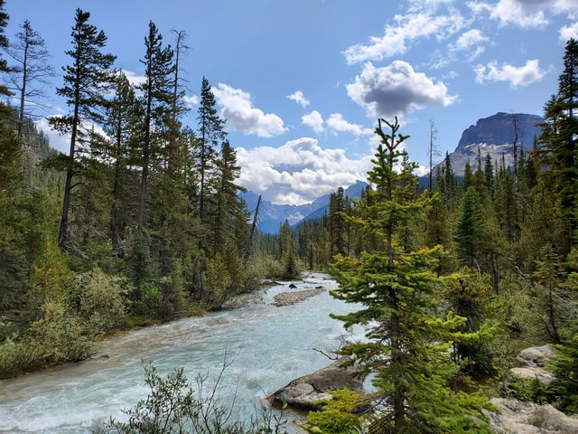

```{r, include=FALSE, eval=FALSE}
# Abstract
# 
# The BC Public Service has seen a significant shift towards the use of R and other data science tools for data analysis and communication. In the natural world, these regime shifts---large, persistent changes to a system---usually require some perturbation (either internal or external) or disturbance event to initiate the shift. This talk will share insider observations of some of the events, processes, and even a disturbance, that have helped kickstart and support the use and growth of R and develop a data science community. Together these changes, with some ongoing organizational support, have enabled some individual contributors, data science teams and leadership in the BC Public Service to shift towards more programmatic, open and reproducible data science workflows.
```


```{r setup, include=FALSE}
options(htmltools.dir.version = FALSE)
options(width = 90)
options(max_print = 5)
options(silence_named_get_record_warning = TRUE)
old.hooks <- fansi::set_knit_hooks(knitr::knit_hooks)
options(crayon.enabled = TRUE)
knitr::opts_chunk$set(
  collapse = TRUE,
  #echo = FALSE,
  comment = "",
  warning = FALSE,
  message = FALSE,
  fig.path = "graphics/prod/figs",
  fig.width = 10,
  fig.height = 5
)
options(scipen = 10)

library(dplyr)
library(bcmaps)
library(sf)
library(ggplot2)
library(viridis)
library(tidycensus)
options(tigris_use_cache = TRUE)
```

```{r, echo=FALSE, cache=TRUE}
cascadia <- get_acs(state = c("WA", "OR"), geography = "state", 
                  variables = "B19013_001", geometry = TRUE) %>% 
  select(NAME) %>% 
  transform_bc_albers() %>% 
  bind_rows(
    bc_neighbours() %>% 
      filter(name == "British Columbia") %>% 
      select(NAME = name)
  )
```

class: clear, no-number

## Cascadia Bioregion

<hr>

.pull-left[

]

.pull-right[

]

.footnote[
Map credit: Lauren Tierney CC BY-SA 4.0]
---

class: clear, no-number

## British Columbia 🇨🇦 &mdash; BC Public Service

<hr>

.wide-right[
```{r, echo=FALSE, fig.height=13, fig.align='left', fig.alt="Simple map of British Columbia, Washington and Oregon bounaries"}
ggplot(cascadia) +
  geom_sf(aes(fill = NAME), alpha = .5) +
  geom_sf_text(aes(label = NAME), size = 10) +
  geom_sf(data = bc_cities() %>% filter(NAME == "Victoria"),
          size = 10, colour = "#3F3770FF") +
  theme_minimal() +
  coord_sf(datum = NA) +
  labs(x = NULL, y = NULL, fill = NULL) +
  theme(legend.position = "none",
        plot.margin = margin(0, 2, 0, 0, unit = "cm")) +
  scale_fill_viridis(discrete = TRUE,
                     option = "mako",
                     begin = .3)
```
]

.pull-left[

]

---

class: clear, no-number

## Growth in the Use of R & the R Ecosystem

<hr>

---

class: clear, no-number

## Regime Shifts in Natural Ecosystems

<hr>

.Large.pull-left[
- Large, persistent changes in the structure and function of a system  
  
- Shifts occur with a smooth change  _or_ a disturbance  

 ]

.pull-right[

  ]
  
.footnote[https://en.wikipedia.org/wiki/Regime_shift]
  
???

- A smooth change in an internal process (feedback)
- _OR_ a disturbance triggering a different system behaviour (external shock)

---

class: clear, no-number

## @stephhazlitt

<hr>



---

class: clear

## Change the beginning

<hr>

---

class: clear

## change 

<hr>

---

class: clear

## single disturbance

<hr>

---

class: clear, center, no-number

## bcgov Data Science Community of Practice

<hr>


---

class: clear, no-number

## Back to Regime Shifts

<hr>

.Large.pull-left[
- non-linear

- many stable states

- expected to increase
 ]

.pull-right[


]


---

class: clear, no-number, center

## Cascadia R Conf 2021: Infectious Ideas

<hr>

"Be Kind, Be Calm, Be Safe"  – Dr. Bonnie Henry 🇨🇦 


@stephhazlitt on Twitter & GitHub  
https://github.com/stephhazlitt/regime-shifts

???

Sessions:
- Sharing R Love
- Reporting & Sharing of R
- Using R
- Shiny and R
- Education & Community


